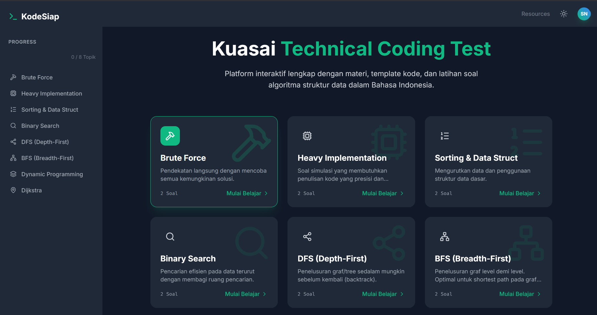

# KodeSiap 🚀

**KodeSiap** adalah platform pembelajaran interaktif yang dirancang untuk membantu developer Indonesia mempersiapkan diri menghadapi **Technical Coding Test** (Algoritma & Struktur Data).

Aplikasi ini menyediakan materi terstruktur, template kode, dan latihan soal dengan antarmuka yang bersih dan mudah digunakan.



## ✨ Fitur Utama

* **📚 Materi Terstruktur**: Mencakup topik-topik penting seperti Brute Force, Sorting, Binary Search, DFS/BFS, hingga Dynamic Programming.
* **🇮🇩 Bahasa Indonesia**: Penjelasan konsep dan soal disajikan sepenuhnya dalam Bahasa Indonesia agar mudah dipahami.
* **💻 Interactive Code Editor**: Editor kode ringan dengan *syntax highlighting* untuk menulis dan menguji solusi (Simulasi).
* **🌙 Dark Mode Support**: Tampilan yang nyaman di mata dengan dukungan mode gelap otomatis atau manual.
* **💾 Progress Tracking**: Menyimpan progress belajar dan soal yang telah diselesaikan secara lokal (Local Storage).
* **💡 Solution Reveal**: Intip solusi referensi lengkap dengan analisis kompleksitas waktu (Time Complexity) dan ruang (Space Complexity).

## 🛠️ Tech Stack

Project ini dibangun menggunakan teknologi modern web development:

* **Frontend**: [React](https://react.dev/) (TypeScript)
* **Styling**: [Tailwind CSS](https://tailwindcss.com/)
* **Icons**: [Lucide React](https://lucide.dev/)
* **Build Tool**: Vite

## 📂 Struktur Project

```text
src/
├── components/
│   ├── CodeBlock.tsx       # Komponen untuk menampilkan snippet kode
│   └── ProblemSolver.tsx   # Editor interaktif dan runner simulasi
├── App.tsx                 # Logic utama layout dan navigasi
├── constants.ts            # Data statis (Soal, Materi, Test Cases)
├── types.ts                # Definisi TypeScript Interface
├── index.tsx               # Entry point aplikasi
└── index.css               # Global styles & Tailwind directives